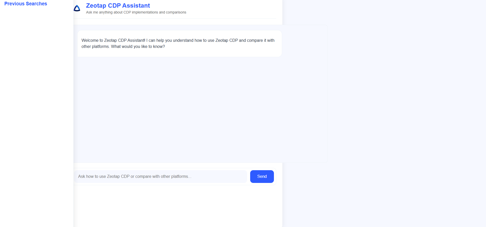
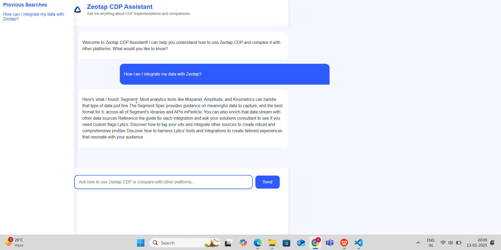
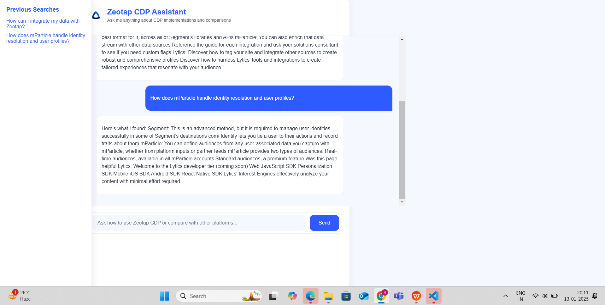

Chatbot for CDP Documentation
=============================

**Overview:**

This project provides a chatbot capable of answering questions related to four Customer Data Platform (CDP) documentations: Segment, mParticle, Lytics, and Zeotap. The chatbot retrieves relevant information from these documentations to assist users with their queries.

Requirements
------------

*   Python 3.7 or higher
*   pip (Python package installer)
*   Flask
*   BeautifulSoup4
*   requests
*   sentence-transformers
*   PyTorch

Installation Steps
------------------

**1\. Clone the Repository**

git clonehttps://github.com/hitankshah/Chatbot-for-CDP-Documentation-

cd Chatbot-for-CDP-Documentation-
    

**2\. Create a Virtual Environment (Optional but recommended)**

python -m venv venv
source venv/bin/activate   # On Windows: venv\\Scripts\\activate
    

**3\. Upgrade pip**

python -m pip install --upgrade pip
    

**4\. Install Dependencies**

pip install flask beautifulsoup4 requests sentence-transformers torch==2.4.1 torchvision==0.19.1  
or 
pip install -r requirements.txt

**5\. Run the Application**

python app.py
    

The application will be accessible at **http://localhost:5000**.

Configuration
-------------

**Documentation URLs:** The chatbot uses the following URLs to fetch documentation content:

*   Segment Documentation: [https://segment.com/docs/?ref=nav](https://segment.com/docs/?ref=nav)
*   mParticle Documentation: [https://docs.mparticle.com/](https://docs.mparticle.com/)
*   Lytics Documentation: [https://docs.lytics.com/](https://docs.lytics.com/)
*   Zeotap Documentation: [https://docs.zeotap.com/home/en-us](https://docs.zeotap.com/home/en-us)

Usage
-----

**UI Access:** Visit [http://localhost:5000](http://localhost:5000) to interact with the chatbot.

**API Endpoint:** You can also make POST requests to /ask with a JSON payload containing the user's query.

### Example Queries

*   "How do I set up a new source in Segment?"
*   "How can I create a user profile in mParticle?"
*   "How do I build an audience segment in Lytics?"
*   "How can I integrate my data with Zeotap?"

Handling Variations
-------------------

The chatbot can handle variations in question phrasing and respond to both specific and general queries related to the supported CDPs.

Advanced Features
-----------------

*   **Cross-CDP Comparisons:** The chatbot can compare functionalities across different CDPs, e.g., "How does Segment's audience creation process compare to Lytics'?"
*   **Complex Queries:** It supports advanced queries on configurations and integrations.

Troubleshooting
---------------

**ModuleNotFoundError:** Ensure all dependencies are installed correctly. Reinstall pip or packages if necessary.

**Version Conflicts:** Verify the compatibility of torch and torchvision if using different versions.

License
-------

This project is licensed under the MIT License. See the LICENSE file for details.
